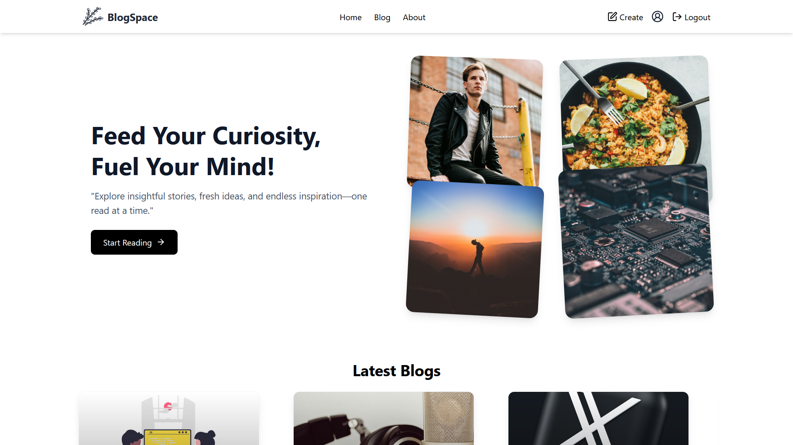
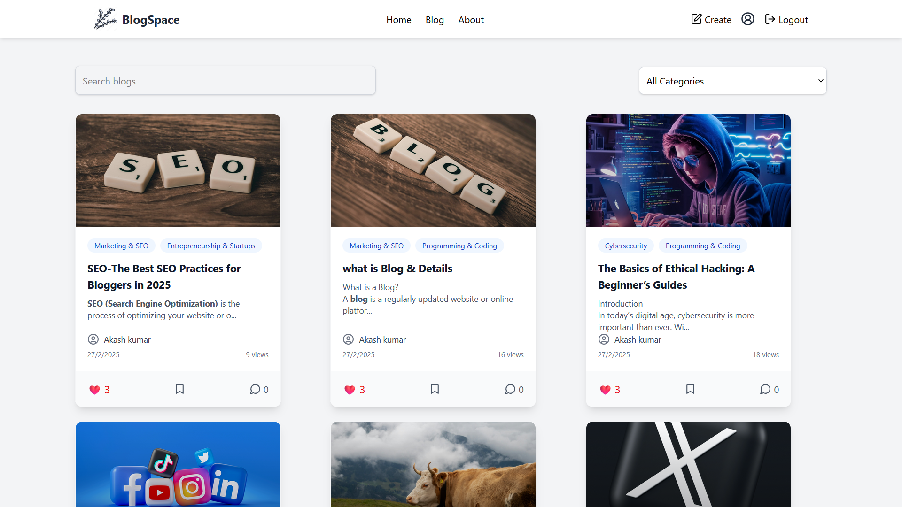
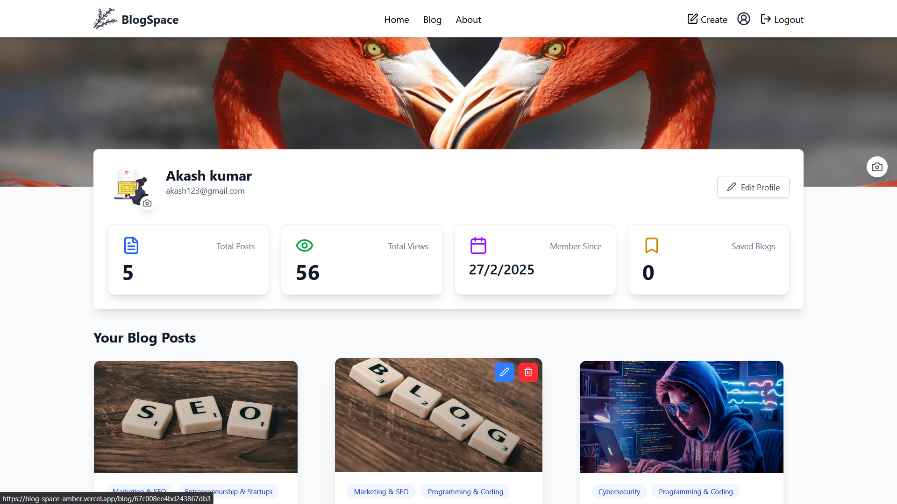
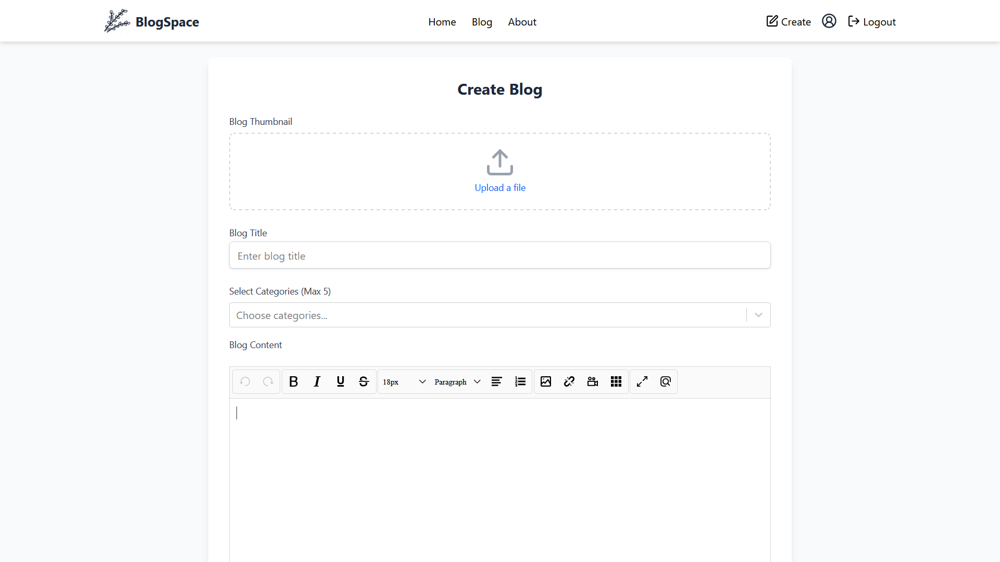
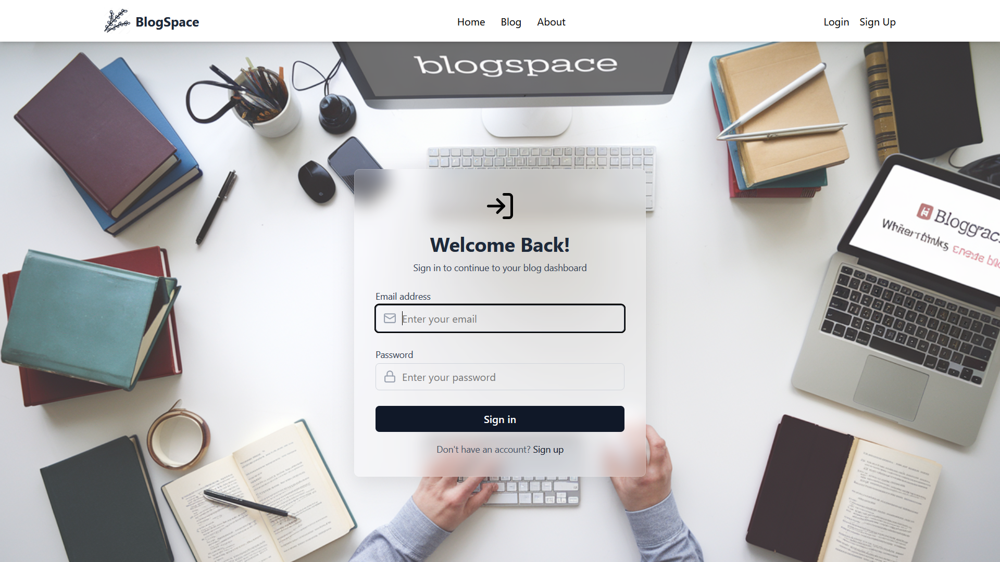
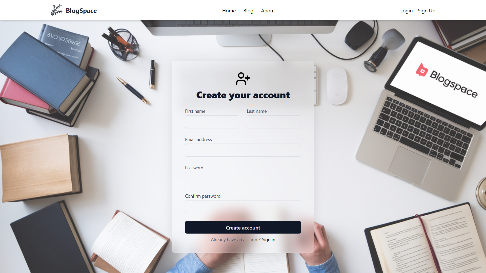

# BlogSpace 📝

A responsive and user-friendly blogging platform to explore, search, and filter blogs by category — with or without login.

 
 
 
 
 
 
 

## 🚀 Features

- View all blogs without login
- Infinite scrolling for smooth browsing
- Search & filter blogs by category
- Mobile-responsive design
- Authenticated users can:
  - Create, edit, or delete their own blogs
  - View personal profiles
- Admin dashboard support

## 🧰 Tech Stack

- **Frontend**: React.js, Tailwind CSS, React Router
- **State Management**: Context API
- **Backend & Auth**: Appwrite

## 📸 Screenshots

> Replace with your image or deploy preview  
> 

## 🔧 Setup Instructions

1. Clone the repo  
   ```bash
   git clone https://github.com/atish0117/blogspace.git
